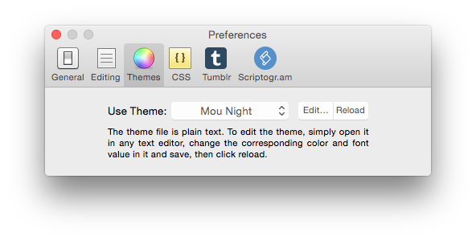
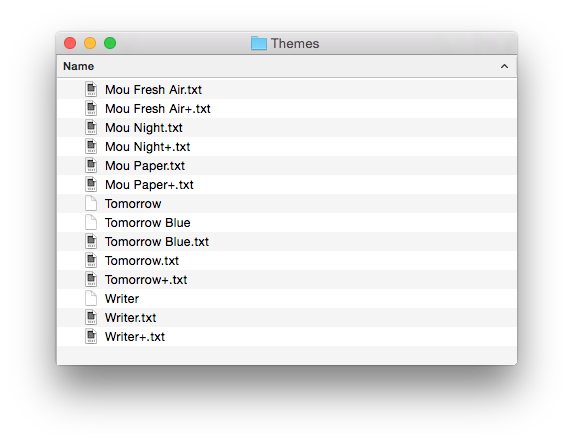

# Cobalt2 Theme for Mou

Theme for the Mou Markdown editor. A port of [Cobalt2 for Sublime Text](https://github.com/wesbos/cobalt2). 

## Installation

1. Navigate to the Preferences window, and then click the Themes tab. From there, click Edit. A window will pop up, showing you the folder that houses the existing themes.
	

2. Move `Cobalt2+.txt` into this folder.
	

3. Back in the Preferences window, click Reload. When you click the dropdown menu to choose a new theme, Cobalt2 should appear.
	

## A work in progress

It always is, and always will be. 